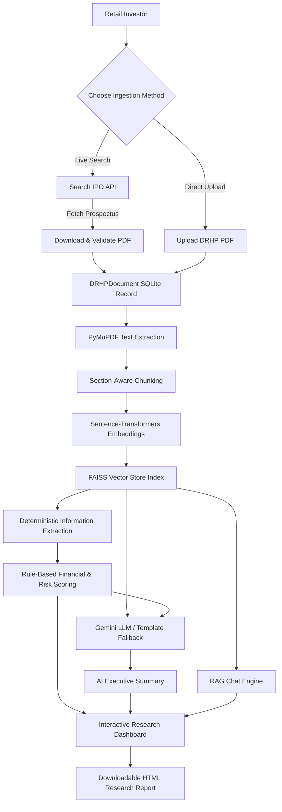
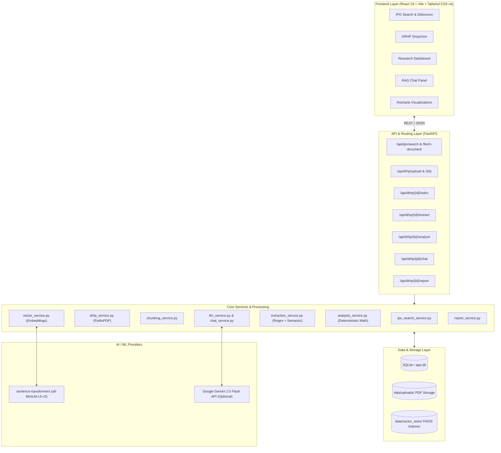

# IPO Research Platform

An end-to-end AI-powered IPO (Initial Public Offering) research and decision-support platform designed to help Indian retail investors evaluate complex DRHP (Draft Red Herring Prospectus) filings. The platform transforms 400+ page regulatory filings into structured financial metrics, transparent risk assessments, promoter evaluations, evidence-grounded AI summaries, and interactive RAG chat.

> **Project Type:** Full-Stack AI/ML & Data Engineering MVP  
> **Status:** Fully Functional Local MVP (38/38 Backend Tests Passing · 0 Frontend Lint Warnings)

---

## 1. Problem

Draft Red Herring Prospectus (DRHP) documents filed with the Securities and Exchange Board of India (SEBI) are the single most important source of fundamental truth before an IPO. However, they present massive barriers for retail investors:

- **Information Overload:** Documents typically span 350 to 700+ pages of dense legal disclosures, corporate restructuring history, and complex notes to accounts.
- **Scattered Financial Data:** Key balance sheet indicators, restated statements of profit and loss, cash flows, and debt obligations are distributed across non-standardized tables and annexures.
- **Hidden Risk Factors:** High-impact operational and legal risks are often buried amidst hundreds of boilerplate disclaimers.
- **Time & Financial Literacy Constraints:** Retail investors rarely have the time or specialized training to calculate normalized debt-to-equity ratios, return on net worth, or promoter dilution before issue closing dates.
- **Market Noise & Speculation:** Decisions are frequently driven by unverified Grey Market Premiums (GMP) and social media hype rather than business fundamentals.

---

## 2. Solution

The platform provides a unified research workflow with two entry points: **Live IPO Search** (discovering filings from official portals) and **Manual DRHP Upload** (analyzing local PDF documents).

Both pathways converge into a single document processing, semantic retrieval, and deterministic analysis pipeline:

1. **Document Ingestion & Text Parsing:** Extracts raw text page-by-page from multi-page PDFs using PyMuPDF while preserving structural markers.
2. **Section-Aware Chunking:** Splits documents into structured chunks based on regulatory headings (Cover Page, Offer Summary, Risk Factors, Financial Statements, Promoters).
3. **Dense Vector Embeddings & Indexing:** Embeds chunks using `all-MiniLM-L6-v2` into isolated, per-document FAISS vector stores for sub-millisecond retrieval.
4. **Hybrid Information Extraction:** Combines targeted regex pattern matching for standardized regulatory disclosures with semantic vector search fallback for unstructured descriptions.
5. **Deterministic Financial & Risk Analysis:** Programmatically computes financial ratios, evaluates balance sheet trends, and scores risk factors with transparent, explainable formulas (avoiding LLM calculation errors).
6. **Generative AI Synthesis (RAG):** Uses Google Gemini 2.0 Flash (with a built-in deterministic heuristic fallback) to generate natural-language executive summaries and power an interactive Q&A assistant grounded in cited document chunks.
7. **Interactive Dashboard & PDF Report:** Renders all metrics, ratings, charts, and audit evidence in a beginner-friendly dashboard and exportable HTML research report.

---

## 3. MVP Features

### Live IPO Search & Discovery
- Real-time search querying Indian IPO filings (via Chittorgarh tracker with SEBI CFDS fallback).
- Debounced live search (400ms) with `AbortController` cancellation to eliminate race conditions.
- Automatic extraction of company name, issue status, sector, price band, issue size, and filing date.
- One-click document retrieval that automatically downloads official DRHP/RHP PDFs and queues them into the analysis engine.

### DRHP PDF Upload & Extraction
- Support for manual drag-and-drop PDF upload (up to 50 MB) with client and server-side magic byte validation (`%PDF-`).
- Page-by-page text extraction and low-text page detection (flagging scanned/image-only pages).
- Non-blocking pipeline progression with real-time stage tracking on the UI.

### Deterministic Financial Analysis
- Extracts Restated Financial Statements (Revenue from Operations, EBITDA, Net Profit/PAT, Net Worth, Total Debt).
- Computes core ratios: PAT Margin, EBITDA Margin, Debt-to-Equity, Current Ratio, Return on Equity (ROE), and Return on Capital Employed (ROCE).
- Programmatically assigns financial health scores (Strong / Moderate / High Risk) with clear, plain-English rationales.

### Risk Factor Classification
- Scans and structures disclosed internal and operational risk factors.
- Categorizes risks (Financial, Operational, Legal/Litigation, Customer/Supplier Concentration).
- Identifies critical concerns (e.g., pending litigation against promoters, customer concentration >50%, negative operating cash flows).

### Promoter & Governance Analysis
- Extracts primary promoter names, leadership experience, and background disclosures.
- Analyzes shareholding patterns and pre-IPO dilution signals.
- Transparent promoter rating (1 to 5 stars) based on governance disclosures.

### Evidence-Grounded RAG Chat
- Interactive chat panel allowing investors to ask specific questions about the prospectus.
- Queries FAISS vector store to retrieve top-k relevant chunks as context.
- Generates answers strictly grounded in document text with clickable page and section citations.

### AI Summary with Graceful Fallback
- Generates concise 2–3 paragraph executive summaries synthesized from extracted facts.
- **Offline / Zero-API-Key Fallback:** If no Gemini API key is configured, the system automatically uses a deterministic heuristic template to generate complete summaries without crashing.

### Research Report Export
- Generates a standalone, print-optimized HTML research report with full audit metadata, scoring breakdowns, financial summaries, and document source provenance.

---

## 4. Product Flow



---

## 5. System Architecture



### Layer Responsibilities

- **Frontend (React 19 / Vite):** Handles user interactions, debounced live search queries, drag-and-drop file uploads, responsive financial metric cards, interactive chat history, and Recharts-based financial charts.
- **Backend API (FastAPI):** Exposes clean REST endpoints with Pydantic v2 schemas for request validation, safe error handling, CORS headers, and asynchronous request execution.
- **Processing & Analysis Engine:** Coordinates text extraction via PyMuPDF, regulatory section chunking, regex pattern extraction, and deterministic mathematical scoring.
- **Data & Vector Storage:** Manages relational metadata in SQLite via SQLAlchemy ORM and stores vector indexes on disk using FAISS.
- **AI / ML Layer:** Generates local 384-dimensional dense embeddings via Sentence Transformers and utilizes Google Gemini (with deterministic heuristic fallback) for narrative synthesis and conversational grounding.

---

## 6. Project Structure

```
ipo-research-platform/
├── backend/
│   ├── app/
│   │   ├── core/                  # App configuration, settings, and filesystem path resolvers
│   │   │   ├── config.py          # Pydantic BaseSettings (.env loading, thresholds, timeouts)
│   │   │   └── paths.py           # Cross-platform project path utilities
│   │   ├── db/                    # Database models and session lifecycle
│   │   │   ├── database.py        # SQLAlchemy engine, session maker, and auto-migration
│   │   │   ├── models.py          # DRHPDocument, Extraction, Analysis, Cache, IPO tables
│   │   │   └── seed.py            # Seed data initialization for local demonstration
│   │   ├── routers/               # FastAPI route definitions
│   │   │   ├── analysis.py        # Trigger and retrieve deterministic analysis
│   │   │   ├── chat.py            # RAG conversational endpoint
│   │   │   ├── drhp.py            # Document upload, indexing, and page text inspection
│   │   │   ├── extraction.py      # Structured information extraction routes
│   │   │   ├── health.py          # Health check endpoint
│   │   │   ├── ipo_search.py      # Live search and document retrieval routes
│   │   │   ├── ipos.py            # Reference IPO catalogue routes
│   │   │   └── report.py          # Standalone HTML report generation route
│   │   ├── schemas/               # Pydantic validation and serialization models
│   │   │   ├── analysis.py        # Financial health, metrics, risks, and promoter schemas
│   │   │   ├── chat.py            # Chat question and answer schemas
│   │   │   ├── drhp.py            # Document upload, pagination, and search request schemas
│   │   │   ├── extraction.py      # Structured company and financial extraction schemas
│   │   │   ├── ipo.py             # IPO summary schemas
│   │   │   └── ipo_search.py      # Live search result and document fetch schemas
│   │   ├── services/              # Core business and analytical logic
│   │   │   ├── analysis_service.py    # Deterministic ratio calculation and score synthesis
│   │   │   ├── chat_service.py        # RAG context retrieval and prompt construction
│   │   │   ├── chunking_service.py    # Section-aware document segmentation
│   │   │   ├── drhp_service.py        # PyMuPDF extraction and file validation
│   │   │   ├── extraction_service.py  # Hybrid regex & semantic field extraction
│   │   │   ├── ipo_search_service.py  # External filing scraper with SQLite cache
│   │   │   ├── ipo_service.py         # Static IPO helper service
│   │   │   ├── llm_service.py         # Gemini API integration and template fallback
│   │   │   ├── report_service.py      # HTML research report template engine
│   │   │   ├── retrieval_service.py   # FAISS semantic search and top-k filtering
│   │   │   └── vector_service.py      # Sentence-Transformers embedding and FAISS management
│   │   └── main.py                # Application entry point and router registration
│   ├── tests/                     # Automated backend test suite (38 unit & integration tests)
│   │   ├── test_error_handling.py         # 10 failure path and fallback tests
│   │   ├── test_extraction_analysis.py    # 4 financial extraction and math tests
│   │   ├── test_ipo_search.py             # 7 search scraper and cache unit tests
│   │   ├── test_ipo_search_api.py         # 12 search and document fetch API tests
│   │   ├── test_pipeline_convergence.py   # 2 end-to-end regression tests
│   │   └── test_source_metadata.py        # 3 provenance persistence tests
│   └── requirements.txt           # Python dependencies
├── frontend/
│   ├── src/
│   │   ├── assets/                # Typography and static styling assets
│   │   ├── components/            # Reusable UI component modules
│   │   │   ├── charts/            # Recharts financial trend visualizations
│   │   │   ├── chat/              # RAG chat drawer and message stream components
│   │   │   ├── common/            # Design system primitives (Cards, Badges, Headers)
│   │   │   ├── dashboard/         # Metrics grid, score cards, risk list, download button
│   │   │   ├── financial/         # Financial statements and ratio indicator cards
│   │   │   ├── home/              # Hero section, feature cards, sample showcase
│   │   │   ├── promoter/          # Promoter background and governance cards
│   │   │   ├── risk/              # Risk factor categorization and severity badges
│   │   │   ├── search/            # Debounced SearchBar and SearchResults cards
│   │   │   └── upload/            # UploadDropzone, FilePreview, and UploadProgress
│   │   ├── pages/                 # Top-level route pages
│   │   │   ├── Home.jsx           # Landing page
│   │   │   ├── GetStarted.jsx     # Dual-tab Search IPO and Upload DRHP hub
│   │   │   ├── Analyzing.jsx      # Live processing pipeline progress view
│   │   │   └── Dashboard.jsx      # Research dashboard view
│   │   ├── services/              # Client API layer (fetch wrappers with AbortSignal)
│   │   ├── utils/                 # Formatting helpers (currency, ratios, dates)
│   │   ├── App.jsx                # Router configuration
│   │   ├── index.css              # Custom design system tokens and Tailwind CSS v4 setup
│   │   └── main.jsx               # React DOM entry point
│   ├── package.json               # Node.js dependencies and build scripts
│   └── vite.config.js             # Vite configuration
├── .env.example                   # Environment configuration template
└── README.md                      # Project documentation
```

---

## 7. Tech Stack

| Area | Technology | Purpose |
|---|---|---|
| **Frontend Framework** | React 19 (`react`, `react-dom`) | Component-driven user interface and dynamic state management |
| **Build Tool** | Vite 8 | Fast local development, Hot Module Replacement (HMR), and production bundling |
| **Styling & Design** | Tailwind CSS v4 & Vanilla CSS Tokens | Custom typography, harmonious color palette, and responsive layouts |
| **Typography** | `@fontsource/inter`, `space-grotesk`, `ibm-plex-mono` | Professional financial typeface pairing |
| **Data Visualization** | Recharts 3 | Responsive multi-year revenue, profit, and debt trend charts |
| **Routing** | React Router DOM v7 | Client-side page navigation (`/`, `/get-started`, `/analyzing`, `/dashboard`) |
| **Frontend Linter** | Oxlint | High-speed JavaScript/JSX code quality and linting |
| **Backend Framework** | FastAPI 0.115 | High-performance Python web framework with asynchronous route support |
| **Server** | Uvicorn 0.32 | ASGI web server |
| **Data Validation** | Pydantic v2 & `pydantic-settings` | Strict schema validation, serialisation, and `.env` parsing |
| **Relational Database** | SQLite via SQLAlchemy 2.0 | Lightweight local persistence for documents, extractions, analyses, and search cache |
| **PDF Extraction** | PyMuPDF (`fitz` 1.24) | High-speed text extraction, page counting, and PDF header verification |
| **Dense Embeddings** | `sentence-transformers` (`all-MiniLM-L6-v2`) | Local 384-dimensional vector embedding generation |
| **Vector Search** | FAISS CPU (`faiss-cpu` 1.15) | Fast local dense vector indexing and similarity search per document |
| **Generative AI** | Google Gemini (`google-generativeai` 0.8) | Grounded RAG conversational responses and executive summaries |
| **Web Scraping** | Requests & BeautifulSoup4 (`bs4`) | Server-side discovery of official Indian IPO filings and prospectus download |
| **Testing** | Python `unittest` & FastAPI `TestClient` | Unit, integration, error-handling, and regression test suites |

---

## 8. AI / ML / GenAI Implementation

### 1. Document Processing & Ingestion
DRHP files are large binary PDFs containing varied layouts. The system uses PyMuPDF (`fitz`) to extract raw text page-by-page, removing null bytes and non-printable noise while recording page numbers for citations. A safety check identifies scanned or unreadable pages by measuring character density per page.

### 2. Section-Aware Chunking
Rather than naive character splitting, the chunker uses regulatory heading detection (e.g., *"SECTION III – RISK FACTORS"*, *"FINANCIAL STATEMENTS"*, *"OUR PROMOTERS"*) to group coherent paragraphs. Chunks are sized between 500 and 1,500 characters with a 150-character sliding overlap, preserving contextual integrity.

### 3. Local Sentence Embeddings
Chunks are encoded using the `all-MiniLM-L6-v2` transformer model (Sentence Transformers). This runs entirely locally on CPU/GPU without external API latency, producing 384-dimensional dense vectors that capture financial and operational semantics.

### 4. Vector Search with FAISS
For each ingested DRHP, an isolated FAISS `IndexFlatIP` (Cosine/Inner Product over normalized embeddings) is constructed on disk (`data/vector_store/<doc_id>/`). When a search query or targeted extraction question is executed, FAISS returns the top-$k$ nearest neighbors with exact similarity scores in under 5 milliseconds.

### 5. Retrieval-Augmented Generation (RAG)
When a user asks a question via the Chat interface:
1. The question is embedded using `all-MiniLM-L6-v2`.
2. FAISS retrieves the top 5 most semantically relevant chunks from that specific document.
3. The retrieved chunks, along with their page numbers and section headers, are injected into a structured system prompt.
4. Google Gemini 2.0 Flash synthesizes a factual, evidence-grounded answer citing the exact pages.
5. If the Gemini API key is missing or unreachable, the chat service falls back gracefully by returning the exact retrieved evidence excerpts with citations.

### 6. Architectural Separation: Deterministic Logic vs. LLM Synthesis
A critical design decision in this platform is **not asking the LLM to calculate numbers**:
- **Deterministic Programmatic Engine:** Financial ratios (margins, current ratio, debt-to-equity), health score cards, and promoter star ratings are calculated strictly in Python using mathematical formulas. This eliminates hallucination risk for critical figures.
- **Generative AI Engine:** LLMs are used solely for narrative synthesis, natural-language explanation, and grounded document search where language fluency is beneficial.

---

## 9. Data & Analytics Perspective

The project follows a disciplined data pipeline modeled on real-world financial data engineering:

```
Unstructured PDF → Text Cleaning → Schema Normalization → Indicator Engineering → Scoring Model → Decision Dashboard
```

1. **Data Cleaning & Normalization:** Resolves Indian numbering notations (Crores, Lakhs, Millions), normalizes currency symbols (₹, Rs., INR), and cleans OCR whitespace artifacts.
2. **Feature Extraction:** Extracts structured entities into strongly typed Pydantic models (`CompanyInfo`, `FinancialMetrics`, `RiskFactor`, `PromoterInfo`).
3. **Indicator Engineering:** Formulates analytical metrics comparing historical periods (e.g., Year-over-Year Revenue Growth, EBITDA Margins, Debt Ratios).
4. **Transparent Scoring Framework:** Implements a multi-factor weighted scoring model (0–100 scale) combining:
   - Financial Health (40% weight: profitability, debt burden, liquidity)
   - Risk Exposure (35% weight: litigation severity, customer concentration)
   - Promoter & Governance Quality (25% weight: experience, dilution)
5. **Decision Support:** Translates raw metrics into categorized risk signals (e.g., *"Debt-to-Equity is 1.8x, indicating elevated financial leverage"*) to empower non-expert retail investors.

---

## 10. Product Thinking

### Target User
Indian retail investors and students who want to perform fundamental due diligence on upcoming IPOs but lack the time or accounting background to read 500-page prospectuses.

### Core User Problems Solved
- **Reduces Due Diligence Time:** Cuts document review time from several hours to under 2 minutes.
- **Democratizes Financial Literacy:** Explains technical terms (such as PAT Margin, ROCE, and Working Capital cycle) in plain English alongside the numbers.
- **Counteracts Hype:** Provides an objective, document-grounded assessment independent of speculative Grey Market Premiums.

### Product Decisions
- **Two Entry Points, One Pipeline:** Users can search live Indian IPOs or upload private PDF filings; both converge into the exact same dashboard experience.
- **Evidence Trail:** Every metric and AI answer cites the underlying source section and page number, enabling verification.
- **No Direct Investment Advice:** The platform presents objective data and risk factors without making prescriptive "Buy" or "Sell" claims.

---

## 11. Key Engineering Decisions

| Decision | Reason | Benefit |
|---|---|---|
| **FastAPI Backend** | High-performance Python framework with native async support and automatic OpenAPI documentation. | Rapid endpoint development, typed Pydantic request validation, and clean Swagger UI for testing. |
| **Separation of Deterministic Scoring & LLM** | LLMs are prone to arithmetic errors and hallucinated financial calculations. | 100% accurate, verifiable, and explainable financial ratios and scoring. |
| **Per-Document FAISS Vector Indexes** | Retail research is conducted on one prospectus at a time. | Prevents cross-document data leakage and enables instant index creation without large cloud vector DB overhead. |
| **Sentence-Transformers `all-MiniLM-L6-v2`** | Lightweight, high-accuracy 384-dimensional embedding model running locally. | Zero embedding API costs, zero external network dependency, and fast CPU inference. |
| **Client-Side Debouncing & `AbortController`** | Real-time typing in the search bar can flood external servers and cause out-of-order responses. | Eliminates race conditions and reduces scraping network traffic. |
| **SQLite with Safe Automatic Schema Migration** | Zero-configuration database ideal for local evaluation and developer setups. | No external database server setup needed; startup hooks automatically apply new columns. |
| **Graceful Offline Fallbacks** | Users may run the app without a Gemini API key or with intermittent internet. | Application remains 100% usable; summaries and chat gracefully degrade to deterministic templates. |

---

## 12. Challenges & What I Learned

During development, building an end-to-end financial RAG application presented several practical engineering challenges:

- **Handling Varied DRHP Layouts:** Indian prospectuses vary significantly in their table structures and cover page headings. Solving this required building a multi-tier extraction pipeline: primary regex matching on standard regulatory strings, secondary pattern search over summary chunks, and semantic vector retrieval as a fallback.
- **Eliminating LLM Hallucinations in Financial Contexts:** Early experiments showed that asking an LLM to extract balance sheet tables often resulted in inverted signs or confused fiscal years. Shifting to deterministic programmatic extraction for tables and reserving the LLM strictly for natural-language summarization ensured data integrity.
- **Managing Real-Time Vector Indexing in a Web Loop:** Generating embeddings for 300+ chunks takes several seconds on CPU. Designing clear pipeline stage transitions (`index` $\rightarrow$ `extract` $\rightarrow$ `analyze`) with responsive frontend progress indicators ensured a smooth user experience.
- **Scraping Robustness & Rate Limiting:** External filing portals can be slow or intermittent. Implementing an SQLite SHA-256 query cache with configurable TTL and exponential backoff ensured the platform remains fast and resilient.

---

## 13. Testing

The repository features an automated test suite with **38 passing tests** covering unit logic, service layers, API routes, failure modes, and end-to-end pipeline convergence:

```bash
cd backend
python -m unittest discover tests
```

### Test Coverage Breakdown

- **Extraction & Analysis (`test_extraction_analysis.py` - 4 tests):** Validates financial ratio formulas, promoter scoring logic, and risk classification rules.
- **IPO Search Service (`test_ipo_search.py` - 7 tests):** Tests deterministic query hashing, cache hit/miss/expiration logic, HTML table parsers, detail page scrapers, and PDF header validation.
- **IPO Search API (`test_ipo_search_api.py` - 12 tests):** Tests `GET /api/ipo/search` and `POST /api/ipo/fetch-document` routes, query validation (`422`), non-PDF rejection (`400`), network timeout handling (`502`), and manual upload endpoint preservation.
- **Pipeline Convergence (`test_pipeline_convergence.py` - 2 tests):** End-to-end regression verifying that both Path A (Manual Upload) and Path B (Search Fetch) create standard `DRHPDocument` records, build FAISS indexes, extract identical schemas, and produce matching analysis outputs.
- **Source Metadata (`test_source_metadata.py` - 3 tests):** Validates provenance tracking (`source_url`, `source_name`) across uploads, searched filings, and generated HTML report headers.
- **Error Handling & Edge Cases (`test_error_handling.py` - 10 tests):** Tests all 12 specified failure paths including provider outage, download timeouts, oversized files (>50MB), corrupted PDFs, and non-existent IDs.

---

## 14. Limitations

To maintain technical honesty, the following constraints of this MVP should be noted:

- **Unstructured Table Variations:** Complex multi-page financial tables with footnotes or merged cells in non-standard DRHPs may require manual verification against the official PDF.
- **Single-Document Focus:** The system is optimized for in-depth analysis of one IPO filing at a time rather than cross-company multi-document screening.
- **Market Data Availability:** Grey Market Premium (GMP) and real-time subscription statistics are not available for offline uploaded DRHPs since they represent unofficial, post-filing secondary indicators.
- **Local Storage Architecture:** Designed as a single-node application using SQLite and local disk FAISS storage; production deployment at enterprise scale would require migrating to PostgreSQL and a managed vector database (e.g., Pinecone or pgvector).

---

## 15. Future Improvements

- **Vision-Based Table Extraction:** Integrate layout-aware models (e.g., Table Transformer or multimodal OCR) to parse complex multi-page financial statements with 100% fidelity.
- **Quantitative RAG Evaluation:** Implement automated evaluation pipelines (using frameworks like Ragas or TruLens) to continuously benchmark context relevance, faithfulness, and answer correctness.
- **Multi-IPO Comparison Engine:** Allow side-by-side comparison of two competing IPOs in the same sector (e.g., comparing valuation multiples and debt profiles).
- **Real-Time Subscription Webhooks:** Ingest live BSE/NSE bidding updates during the 3-day public issue window.
- **Production Infrastructure:** Containerize with Docker, migrate to PostgreSQL, and implement Redis-backed asynchronous job queues (Celery/RQ) for high-concurrency document processing.

---

## 16. Getting Started

### Prerequisites

- **Python 3.11+** with `pip`
- **Node.js 18+** with `npm`
- *(Optional)* **Google Gemini API Key** for LLM summaries and conversational Q&A ([Get free API key](https://aistudio.google.com/apikey))

---

### Step 1: Clone Repository & Setup Environment

```bash
cd ipo-research-platform

# Copy environment template
cp .env.example backend/.env
```

---

### Step 2: Backend Setup & Launch

```bash
# Navigate to backend
cd backend

# Create and activate virtual environment (recommended)
python3 -m venv .venv
source .venv/bin/activate  # On Windows: .venv\Scripts\activate

# Install dependencies
pip install -r requirements.txt

# Start FastAPI backend server
uvicorn app.main:app --reload --port 8000
```

The backend will start at **http://localhost:8000** (Interactive Swagger API documentation available at **http://localhost:8000/docs**).

---

### Step 3: Frontend Setup & Launch

Open a new terminal window:

```bash
# Navigate to frontend
cd frontend

# Install dependencies
npm install

# Start Vite development server
npm run dev
```

The frontend will be live at **http://localhost:5173**.

---

### Environment Variables Configuration

Edit `backend/.env` if you wish to configure optional settings:

```env
# Application Environment
APP_ENV=development
DATABASE_URL=sqlite:///./data/app.db
UPLOAD_DIR=./data/uploads
VECTOR_STORE_DIR=./data/vector_store
MAX_UPLOAD_SIZE_MB=50

# Embedding & Retrieval Settings
EMBEDDING_MODEL_NAME=all-MiniLM-L6-v2
RETRIEVAL_TOP_K_DEFAULT=5

# Optional: Google Gemini API Key (leaves template fallback active if blank)
GEMINI_API_KEY=your_gemini_api_key_here

# Live IPO Search Settings
IPO_SEARCH_CACHE_TTL_HOURS=6
IPO_SEARCH_REQUEST_TIMEOUT=15
```

---

## 17. API Reference

| Method | Endpoint | Description |
|---|---|---|
| `GET` | `/api/health` | Service health status check |
| `GET` | `/api/ipo/search?q={query}` | Search live Indian IPO filings with SQLite caching |
| `POST` | `/api/ipo/fetch-document` | Download official prospectus from external URL and ingest into pipeline |
| `POST` | `/api/drhp/upload` | Upload local DRHP PDF (multipart/form-data) |
| `GET` | `/api/drhp/{id}` | Retrieve document metadata and source provenance |
| `POST` | `/api/drhp/{id}/index` | Segment document, generate embeddings, and build FAISS vector index |
| `GET` | `/api/drhp/{id}/index/status` | Check vector index construction status |
| `POST` | `/api/drhp/{id}/extract` | Run structured information extraction (company, parameters, financials) |
| `GET` | `/api/drhp/{id}/extraction` | Fetch persisted extraction JSON |
| `POST` | `/api/drhp/{id}/analyze` | Execute deterministic financial and risk analysis |
| `GET` | `/api/drhp/{id}/analysis` | Fetch persisted analysis results and scoring |
| `POST` | `/api/drhp/{id}/chat` | Ask document-grounded question via RAG pipeline |
| `GET` | `/api/drhp/{id}/report` | Generate and download standalone HTML research report |

---

## 18. Screenshots & User Interface

*(Add application screenshots here)*

- **Get Started Hub:** Search Indian IPOs or drag-and-drop local DRHP PDFs.
- **Analysis Pipeline View:** Real-time feedback as documents are indexed, extracted, and scored.
- **Research Dashboard:** High-level overall score, key parameters, plain-English metric explanations, and financial trend charts.
- **RAG Chat Panel:** Interactive conversational drawer providing cited answers from prospectus text.
- **Exportable Report:** Clean, print-ready HTML summary for offline review.

---

## 19. Responsible Use & Disclaimer

This project is developed as an educational and portfolio decision-support MVP. 

- **Not Financial Advice:** The outputs, scores, summaries, and risk classifications generated by this platform do not constitute investment advice, financial recommendations, or endorsements to subscribe to any security.
- **Verification Required:** Financial figures and legal disclosures are extracted via automated computational methods and may contain inaccuracies. Users must verify all critical parameters against official SEBI filings and company prospectuses before making financial commitments.
- **Regulatory Independence:** This project is independent and is not affiliated with SEBI, BSE, NSE, or any financial institution.

---

## 20. Author & Project Details

- **Developer:** Full-Stack & Applied AI / ML Developer
- **Focus Areas:** Natural Language Processing (NLP), Information Retrieval (RAG), Applied Machine Learning, Full-Stack Web Development (FastAPI + React)
- **Repository:** IPO Research Platform MVP
