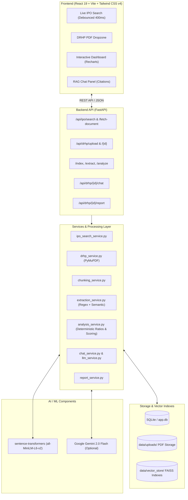

# IPO Research Platform

> AI-powered IPO due-diligence platform that transforms lengthy DRHP documents into structured financial, legal, promoter, risk, and research insights.

🚀 **Live Demo:** [https://ipo-due-diligence-1.onrender.com](https://ipo-due-diligence-1.onrender.com)  
🔗 **Backend API:** [https://ipo-due-diligence.onrender.com](https://ipo-due-diligence.onrender.com)

---

## 🎯 Overview

Draft Red Herring Prospectus (DRHP) filings submitted to SEBI contain essential fundamental data for pre-IPO companies. However, their 400–700 page length, unstructured financial tables, scattered risk factors, and dense legal disclosures create severe information barriers for retail investors.

The **IPO Research Platform** automates prospectus ingestion, regulatory section chunking, semantic vector indexing, deterministic financial analysis, and evidence-grounded generative Q&A through an intuitive web application—reducing fundamental due-diligence time from hours to minutes.

---

## ✨ Key Features

- **Live IPO Search & Document Ingestion:** Search active and upcoming Indian IPOs with server-side SQLite TTL caching and fetch official DRHP/RHP PDFs directly from public filing portals.
- **Direct DRHP PDF Upload:** Drag-and-drop support for local prospectus files (up to 50 MB) with client and server-side PDF header validation (`%PDF-`).
- **Section-Aware Chunking & FAISS Vector Store:** Contextual segmentation aligned with regulatory chapter hierarchies, indexed with local 384-dimensional dense embeddings (`all-MiniLM-L6-v2`) in isolated per-document FAISS indexes.
- **Deterministic Financial & Ratio Analysis:** Programmatic extraction and calculation of core indicators—PAT Margin, EBITDA Margin, Debt-to-Equity, Current Ratio, ROE, and ROCE—eliminating arithmetic hallucinations.
- **Explainable Multi-Factor Scoring:** Transparent, rule-based 0–100 overall assessment combining Financial Health (40%), Risk Severity (35%), and Promoter Governance (25%).
- **Structured Risk Classification:** Automatic extraction and tagging of disclosed risks across Financial, Operational, Litigation, and Customer/Supplier Concentration.
- **Evidence-Grounded RAG Chat:** Conversational assistant powered by Google Gemini 2.0 Flash with exact page and section citations (includes offline deterministic excerpt fallback).
- **AI Executive Summary:** Narrative synthesis summarizing business model fundamentals, competitive strengths, and primary concerns.
- **Downloadable HTML Research Report:** Standalone, print-ready research report with complete audit trails and document source provenance.

---

## 🏗️ Architecture

Both **Live Search** and **Direct PDF Upload** converge into a standardized document processing, indexing, and analysis engine.



---

## 🔄 How It Works

1. **Document Ingestion:** The user searches for an Indian IPO or uploads a DRHP PDF. The backend validates file integrity and creates a `DRHPDocument` record.
2. **Text Parsing & Chunking:** PyMuPDF extracts raw text page-by-page. The chunking service segments the document by regulatory headings into overlapping context blocks.
3. **Dense Indexing:** Local `all-MiniLM-L6-v2` embeddings are generated for every chunk and stored in an isolated per-document FAISS index on disk.
4. **Structured Extraction:** A hybrid extraction engine pairs deterministic regex matching for standardized disclosures (company name, CIN, issue size, financial tables) with semantic vector search fallback.
5. **Deterministic Financial Analysis:** Mathematical formulas compute profitability margins, debt-to-equity leverage, working capital ratios, and promoter governance scores.
6. **AI Synthesis & Grounded Chat:** Google Gemini (or the offline template fallback) generates an executive summary. The RAG chat engine retrieves the most relevant chunks to answer user queries with page citations.
7. **Dashboard & Report:** The user reviews findings on the interactive dashboard and can export a standalone HTML research report.

---

## 🧠 AI / RAG Pipeline

The platform uses a retrieval-grounded architecture to ensure factual accuracy and avoid token overflow on 500-page prospectuses:

- **Section-Aware Chunking:** Segments text into 500–1,500 character chunks with 150-character sliding overlap aligned with structural headings (*Risk Factors*, *Financial Statements*, *Our Promoters*).
- **Local Dense Embeddings:** Encodes chunks using `sentence-transformers` (`all-MiniLM-L6-v2`) locally on CPU, producing 384-dimensional dense vectors with zero external API latency or cost.
- **Per-Document FAISS Indexing:** Constructs isolated `IndexFlatIP` (Cosine/Inner Product) vector stores on disk per document, preventing cross-document contamination.
- **Targeted Semantic Retrieval:** Retrieves top-$k$ relevant chunks (default $k=5$, cosine relevance threshold $\ge 0.2$) based on query embeddings.
- **Context-Injected Grounding:** Injects retrieved chunk text, page numbers, and section headers into structured prompts for Google Gemini 2.0 Flash.
- **Architectural Separation (Deterministic vs. Generative):** Financial ratios and scoring are calculated programmatically in Python rather than delegated to an LLM, eliminating arithmetic hallucinations.
- **Zero-Crash Offline Fallback:** If the Gemini API key is missing or unreachable, the system automatically uses a deterministic heuristic template for summaries and returns exact retrieved evidence excerpts for chat.

---

## 🛠️ Tech Stack

### Frontend
- **Framework:** React 19, Vite
- **Routing:** React Router DOM v7
- **Styling:** Tailwind CSS v4, Custom CSS Tokens
- **Visualizations:** Recharts 3
- **Typography:** Fontsource (`Inter`, `Space Grotesk`, `IBM Plex Mono`)

### Backend & API
- **Framework:** FastAPI 0.115, Uvicorn (ASGI)
- **Validation:** Pydantic v2, `pydantic-settings`
- **Database:** SQLite via SQLAlchemy 2.0 ORM

### AI / ML & Information Retrieval
- **Embeddings:** Sentence Transformers (`all-MiniLM-L6-v2`, 384-dim)
- **Vector Store:** FAISS CPU (`faiss-cpu` 1.15)
- **Generative AI:** Google Gemini 2.0 Flash (`google-generativeai`)

### Data Processing & Ingestion
- **PDF Extraction:** PyMuPDF (`fitz` 1.24)
- **Web Scraping:** Requests, BeautifulSoup4 (`bs4`)

### Deployment
- **Platform:** Render (Web Service + Static Site)

---

## 📡 Backend & API

The FastAPI backend exposes structured REST endpoints with strict Pydantic v2 schemas:

| Capability | Method & Route | Description |
|---|---|---|
| **Health Check** | `GET /api/health` | Service health status |
| **Live IPO Search** | `GET /api/ipo/search?q={query}` | Search Indian IPO filings with SQLite caching |
| **Document Fetch** | `POST /api/ipo/fetch-document` | Retrieve official prospectus PDF from URL and ingest into pipeline |
| **DRHP Upload** | `POST /api/drhp/upload` | Upload local DRHP PDF (`multipart/form-data`) |
| **Document Metadata** | `GET /api/drhp/{id}` | Retrieve document page count, size, and source provenance |
| **Vector Indexing** | `POST /api/drhp/{id}/index` | Segment text, compute embeddings, and build FAISS index |
| **Structured Extraction** | `POST /api/drhp/{id}/extract` | Run hybrid regex/semantic extraction for company & financial data |
| **Financial Analysis** | `POST /api/drhp/{id}/analyze` | Execute deterministic financial scoring and risk classification |
| **RAG Chat** | `POST /api/drhp/{id}/chat` | Ask grounded questions with exact page and section citations |
| **Research Report** | `GET /api/drhp/{id}/report` | Generate and download standalone HTML research report |

---

## 🧪 Testing

The backend includes a comprehensive automated test suite with **38 passing tests** covering unit logic, service layers, API endpoints, failure modes, and end-to-end pipeline convergence:

```bash
cd backend
python -m unittest discover tests
```

- **Extraction & Analysis (`test_extraction_analysis.py` - 4 tests):** Validates financial ratio formulas, promoter scoring logic, and risk classification rules.
- **IPO Search Service (`test_ipo_search.py` - 7 tests):** Tests deterministic query hashing, cache hit/miss/expiration logic, HTML table parsers, detail page scrapers, and PDF header validation.
- **IPO Search API (`test_ipo_search_api.py` - 12 tests):** Tests `GET /api/ipo/search` and `POST /api/ipo/fetch-document` routes, query validation (`422`), non-PDF rejection (`400`), network timeout handling (`502`), and manual upload endpoint preservation.
- **Pipeline Convergence (`test_pipeline_convergence.py` - 2 tests):** End-to-end regression verifying that both Path A (Manual Upload) and Path B (Search Fetch) create standard `DRHPDocument` records, build FAISS indexes, extract identical schemas, and produce matching analysis outputs.
- **Source Metadata (`test_source_metadata.py` - 3 tests):** Validates provenance tracking (`source_url`, `source_name`) across uploads, searched filings, and generated HTML report headers.
- **Error Handling & Edge Cases (`test_error_handling.py` - 10 tests):** Tests all 12 failure paths including provider outage, download timeouts, oversized files (>50MB), corrupted PDFs, and non-existent IDs.
- **Frontend Code Quality (`oxlint`):** 0 errors and 0 warnings across 53 files in under 20ms.

---

## 💡 Key Engineering Highlights

- **Deterministic Math & Scoring:** Financial ratios and multi-factor scores are calculated strictly in Python using mathematical formulas. The LLM is restricted to narrative synthesis, eliminating arithmetic hallucinations.
- **Per-Document Vector Isolation:** Rather than maintaining a single monolithic vector database, each prospectus builds an isolated FAISS index on disk, eliminating cross-document data leakage.
- **Zero-API Local Embedding Pipeline:** Generates 384-dimensional embeddings locally on CPU via `all-MiniLM-L6-v2`, avoiding per-token embedding costs and external network bottlenecks.
- **Race Condition Prevention:** Client-side search implements 400ms debouncing combined with native `AbortController` cancellation, immediately terminating stale in-flight requests.
- **Resilient Offline Fallback:** Fully operational without a Gemini API key; executive summaries degrade gracefully to rule-based templates, and chat returns exact retrieved document excerpts.
- **Safe Automatic Schema Migration:** SQLite initialization inspects existing database tables and applies non-destructive column additions on startup.

---

## 📁 Project Structure

```
ipo-research-platform/
├── backend/
│   ├── app/
│   │   ├── core/                  # App configuration and filesystem path resolvers
│   │   ├── db/                    # SQLAlchemy models, database setup, and auto-migration
│   │   ├── routers/               # FastAPI route modules (search, drhp, extraction, analysis, chat, report)
│   │   ├── schemas/               # Pydantic v2 validation and response models
│   │   ├── services/              # Core business, analytical, RAG, and extraction services
│   │   │   ├── analysis_service.py    # Deterministic ratio calculation and score synthesis
│   │   │   ├── chat_service.py        # RAG context retrieval and prompt construction
│   │   │   ├── chunking_service.py    # Section-aware document segmentation
│   │   │   ├── drhp_service.py        # PyMuPDF extraction and file validation
│   │   │   ├── extraction_service.py  # Hybrid regex & semantic field extraction
│   │   │   ├── ipo_search_service.py  # External filing scraper with SQLite cache
│   │   │   ├── llm_service.py         # Gemini API integration and template fallback
│   │   │   ├── report_service.py      # HTML research report template engine
│   │   │   └── vector_service.py      # Sentence-Transformers embeddings & FAISS management
│   │   └── main.py                # FastAPI entry point & CORS configuration
│   ├── tests/                     # 38 automated test cases across 6 backend suites
│   └── requirements.txt           # Python dependencies
├── frontend/
│   ├── src/
│   │   ├── components/            # UI components (charts, chat, dashboard, financial, risk, search, upload)
│   │   ├── pages/                 # Route views (Home, GetStarted, Analyzing, Dashboard)
│   │   ├── services/              # Client API client with AbortSignal request cancellation
│   │   ├── App.jsx                # Router configuration
│   │   └── index.css              # Custom design system tokens and Tailwind CSS v4 setup
│   ├── package.json               # Frontend dependencies and scripts
│   └── vite.config.js             # Vite configuration
├── .env.example                   # Environment configuration template
└── README.md                      # Project documentation
```

---

## ☁️ Deployment

The application is live on **Render**:

- **Frontend:** [https://ipo-due-diligence-1.onrender.com](https://ipo-due-diligence-1.onrender.com) (Render Static Site hosting the compiled Vite production bundle)
- **Backend API:** [https://ipo-due-diligence.onrender.com](https://ipo-due-diligence.onrender.com) (Render Web Service running the FastAPI ASGI application)
- **Configuration:** Production API communication is linked via `VITE_API_BASE_URL` on the frontend.

---

## ⚠️ Disclaimer

This platform is intended for research and educational purposes only. It does not provide certified financial advice, investment recommendations, or solicitations to subscribe to any security. All figures and disclosures are extracted via automated computational methods and should be independently verified against official SEBI filings and company prospectuses.
